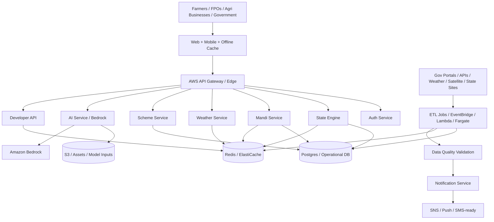

# National Agriculture Super Platform

## System Architecture Diagram

## Database Schema

### Core Operational Tables

| Table               | Purpose                                     | Key Columns                                                                         |
| ------------------- | ------------------------------------------- | ----------------------------------------------------------------------------------- |
| `users`             | Identity, role, profile, language, location | `id`, `role`, `location`, `primary_crops`, `assigned_regions`                       |
| `market_profiles`   | Normalized mandi master data                | `name`, `state`, `district`, `commodities`, `facilities`                            |
| `mandi_entries`     | Raw and approved market prices/arrivals     | `state`, `district`, `market`, `commodity`, `arrival_date`, `modal_price`, `status` |
| `price_actuals`     | Canonical verified market actuals           | `crop`, `market`, `date`, `price`, `source`, `fetched_at`                           |
| `recommendations`   | Crop, water, price, and AI outputs          | `user_id`, `kind`, `request_payload`, `response_payload`                            |
| `conversations`     | Advisory and AI conversation history        | `user_id`, `messages`, `language`, `created_at`                                     |
| `integration_audit` | Upstream source calls and failures          | `event`, `payload`, `created_at`                                                    |
| `operations_runs`   | ETL and retrain job telemetry               | `operation`, `status`, `triggered_at`, `metrics`                                    |
| `feedback`          | Outcome and sustainability signals          | `user_id`, `rating`, `yield_kg_per_acre`, `income_inr`                              |
| `tickets`           | Support workflow                            | `created_by`, `assignee`, `status`, `messages`                                      |

### Platform Expansion Tables

| Table                 | Purpose                                                | Suggested Keys                                                            |
| --------------------- | ------------------------------------------------------ | ------------------------------------------------------------------------- |
| `geo_hierarchy_nodes` | India -> state -> district -> block -> village mapping | `node_id`, `level`, `parent_id`, `source`, `geo_code`                     |
| `scheme_catalog`      | Central and state schemes                              | `scheme_id`, `scope`, `state`, `eligibility_rules`, `apply_url`           |
| `weather_snapshots`   | Cached district/block weather records                  | `location_key`, `forecast_date`, `temperature_c`, `rainfall_mm`, `source` |
| `satellite_indices`   | NDVI and remote-sensing layers                         | `tile_id`, `district`, `village`, `captured_at`, `index_type`, `value`    |
| `persona_workspaces`  | Saved per-persona filters and dashboards               | `user_id`, `persona`, `state`, `district`, `crop`                         |
| `notification_events` | Alert delivery pipeline                                | `channel`, `recipient_id`, `event_type`, `status`, `sent_at`              |
| `api_clients`         | Developer platform consumers                           | `client_id`, `tier`, `api_key_hash`, `rate_plan`, `status`                |

## API Endpoints

### Internal Platform APIs

| Endpoint                                                 | Method | Purpose                                                                          |
| -------------------------------------------------------- | ------ | -------------------------------------------------------------------------------- |
| `/api/v1/state-engine/catalog`                           | `GET`  | 36-region state and UT catalog with source coverage                              |
| `/api/v1/state-engine/resolve`                           | `GET`  | Resolve state, district, block, village, and postal context from query or GPS    |
| `/api/v1/state-engine/intelligence`                      | `GET`  | State-specific mandi, weather, schemes, alerts, recommendations                  |
| `/api/v1/platform/blueprint`                             | `GET`  | Data sources, personas, APIs, microservices, pipeline jobs                       |
| `/api/v1/platform/hierarchy`                             | `GET`  | Location hierarchy resolution for India -> state -> district -> block -> village |
| `/api/v1/platform/workspace`                             | `GET`  | Persona-aware workspace payload                                                  |
| `/api/v1/platform/subscriptions`                         | `GET`  | Monetization tiers and persona targeting                                         |
| `/api/v1/operations/schedule/trigger/state-portal-sync`  | `POST` | Admin-triggered state portal and directory snapshot sync                         |
| `/api/v1/operations/schedule/trigger/geo-hierarchy-sync` | `POST` | Admin-triggered district/block/village hierarchy sync                            |

### Public Developer APIs

| Endpoint                            | Method | Purpose                            |
| ----------------------------------- | ------ | ---------------------------------- |
| `/api/v1/public/mandi-prices`       | `GET`  | Approved mandi prices              |
| `/api/v1/public/prices`             | `GET`  | Price feed alias                   |
| `/api/v1/public/arrivals`           | `GET`  | Arrivals feed                      |
| `/api/v1/public/mandis`             | `GET`  | Public mandi directory             |
| `/api/v1/public/weather`            | `GET`  | Weather feed                       |
| `/api/v1/public/state-intelligence` | `GET`  | Persona-aware state intelligence   |
| `/api/v1/public/api-catalog`        | `GET`  | Public API catalog for integrators |
| `/api/ai/advisor`                   | `POST` | Bedrock-backed crop advisory       |

## UI Component Structure

### Core Navigation

- `Home Dashboard`
- `Mandi Market`
- `AI Advisor`
- `Schemes`
- `Weather`
- `My Farm`

### Platform UI Layers

| Component                             | Responsibility                                           |
| ------------------------------------- | -------------------------------------------------------- |
| `AppLayout`                           | Global shell, role/persona menus, notifications, portals |
| `NationalAgricultureIntelligencePage` | Persona-aware state and district intelligence workspace  |
| `MarketIntelligencePage`              | Trading-style mandi market workflows                     |
| `AdvisoryPage`                        | AI crop advisor and future voice workflows               |
| `ProfilePage`                         | Farm profile, language, role, and location preferences   |
| `DashboardPage`                       | Operational overview and role-specific monitoring        |

## Data Pipeline Design

### Ingestion Modes

- API pull for official datasets like Agmarknet/data.gov.in
- Portal federation for eNAM, PM-KISAN, mKisan, Kisan Suvidha, PMFBY, Soil Health Card
- Live state-portal snapshot workers with cached fallback for all 36 regions
- Geospatial ingestion for district, block, village, and postal-code hierarchy layers

### ETL Stages

1. Extract from official APIs, portals, and curated scrapers
2. Normalize into unified geography and crop schema
3. De-duplicate by `state + district + market + commodity + date + source`
4. Validate freshness, price bounds, null rates, and schema drift
5. Cache hot data in Redis and persist canonical records in Postgres
6. Emit alerts for stale feeds, anomaly spikes, and ingestion failures

### Job Cadence

- Mandi refresh: every 10 minutes
- Weather refresh: every 30 minutes
- Scheme sync: every 6 hours
- State portal refresh: daily
- Geo hierarchy refresh: weekly when dataset URLs are configured
- Data-quality validation: every 15 minutes

## Service Entrypoints

The repo now supports both the integrated backend and service-oriented runtime slices:

- `npm run backend:dev`
- `npm run backend:auth-service:dev`
- `npm run backend:state-engine:dev`
- `npm run backend:mandi-service:dev`
- `npm run backend:developer-api:dev`

## Deployment Steps

1. Put API Gateway in front of the platform and route traffic by service path.
2. Split compute into service groups:
   - FastAPI services on ECS/Fargate or EKS for `auth`, `state-engine`, `mandi`, `scheme`, `weather`, `developer-api`
   - Node.js advisory service on ECS/Fargate for Bedrock-backed AI
   - Lambda for alerts, ETL fan-out, and lightweight public APIs
3. Use Postgres/Aurora for system-of-record data and Redis/ElastiCache for hot caches.
4. Store uploads, model inputs, exports, and large ETL artifacts in S3.
5. Run ETL orchestration on EventBridge schedules and Step Functions where multi-stage jobs are required.
6. Use IAM roles per service, KMS encryption, Secrets Manager, and WAF in front of API Gateway.
7. Attach CloudWatch, structured logs, metrics, alarms, and tracing for service, ETL, and Bedrock latency.
8. Add multi-AZ database deployment, autoscaling service tasks, and CDN caching for static assets.
9. Create distinct rate plans for internal users, public APIs, and enterprise API clients.
10. Gate production rollout behind load tests, chaos drills, and data-quality SLO monitoring.
